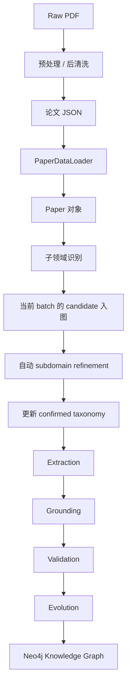

# 当前实验流程

## 1. 总流程图



## 2. 流程说明

### 阶段 1：PDF 预处理

目标：
- 将原始 PDF 转成结构化论文 JSON
- 尽量恢复章节标题、正文顺序、摘要等信息
- 去掉页眉页脚、版权说明、作者单位、尾部垃圾 section

当前相关文件：
- `/Users/joer/Gitroom/Multidoc-KG-zya/data/preprocess/bookmark_based_splitter.py`
- `/Users/joer/Gitroom/Multidoc-KG-zya/data/preprocess/clean_processed_papers.py`
- `/Users/joer/Gitroom/Multidoc-KG-zya/data/preprocess/preprocess.py`

输出目录：
- `/Users/joer/Gitroom/Multidoc-KG-zya/data/processed_papers`
- `/Users/joer/Gitroom/Multidoc-KG-zya/data/cleaned_papers`

当前判断：
- 已达到“可继续主线实验”的程度
- 对复杂双栏综述仍不完美，但不再是当前主阻塞项

### 阶段 2：论文加载

目标：
- 从 JSON 中加载论文
- 整理为统一的 `Paper` 对象
- 抽出 `title / abstract / keywords / sections`

当前相关文件：
- `/Users/joer/Gitroom/Multidoc-KG-zya/data_loader.py`
- `/Users/joer/Gitroom/Multidoc-KG-zya/schema.py`

### 阶段 3：子领域识别

目标：
- 给每篇论文分配一个 biomedical subdomain
- 该 subdomain 要求“不大不小”
- 同时给出更上位的 `parent_domain`
- 如有必要，补出新的 `subclass_of` 候选关系

当前相关文件：
- `/Users/joer/Gitroom/Multidoc-KG-zya/agents/subdomain.py`
- `/Users/joer/Gitroom/Multidoc-KG-zya/config/subdomain_config.yaml`

输入：
- `title + abstract + keywords`
- 必要时补充内容摘要
- 当前 Neo4j 中已有的 subdomain hierarchy

输出：
- `SubdomainAssignment`
- 写回 `paper.metadata`

说明：
- 正常情况下由 LLM 输出结构化 JSON
- 若 LLM 失败，会回退到轻量规则

### 阶段 4：当前 batch 的 candidate 入图

目标：
- 将本批次新分类结果先写成候选层
- 区分：
  - `Subdomain`（confirmed）
  - `SubdomainCandidate`（candidate）

当前相关文件：
- `/Users/joer/Gitroom/Multidoc-KG-zya/core/neo4j_store.py`

说明：
- `Paper -[:SUGGESTS_SUBDOMAIN]-> SubdomainCandidate`
- `SubdomainCandidate -[:CANDIDATE_SUBCLASS_OF]-> Subdomain`

这一步是 lifecycle 中间层，不是最终正式 taxonomy。

### 阶段 5：自动 subdomain refinement

目标：
- 对当前 batch 的 candidate 做整理
- 决定每个 candidate：
  - `merge` 到已有 confirmed subdomain
  - 或 `promote` 成新的 confirmed subdomain

当前相关文件：
- `/Users/joer/Gitroom/Multidoc-KG-zya/agents/subdomain_refinement.py`

当前行为：
- 主线中每个 batch 分类结束后，会自动跑一次 refinement
- 不再需要人工单独补跑

输出：
- `MERGED_INTO`
- `PROMOTED_TO`
- 更新 `CLASSIFIED_AS`
- 推进 `taxonomy_version`

### 阶段 6：更新 confirmed taxonomy

目标：
- 将本批次 refinement 后的结果写回正式层
- 让下一批论文在更稳定的 hierarchy 上继续分类

当前表现：
- taxonomy 是 batch-evolving 的
- 每一批分类都建立在上一个版本的 confirmed hierarchy 上

### 阶段 7：Extraction

目标：
- 从论文正文中抽取知识声明
- 区分：
  - ontology layer
  - instance layer

当前相关文件：
- `/Users/joer/Gitroom/Multidoc-KG-zya/agents/extraction.py`
- `/Users/joer/Gitroom/Multidoc-KG-zya/config/extraction_config.yaml`

当前输入：
- `paper.content`
- `paper.title / abstract / keywords`
- `paper.metadata["subdomain"]`
- `paper.metadata["parent_domain"]`

当前特点：
- 已切到受控 biomedical relations
- 增强了 study/meta 叙事过滤
- 对 `Introduction / Methods` 加了更严格的 section 限制
- 每块默认最多保留 `15` 条高优先级 claim

### 阶段 8：Grounding

目标：
- 将抽取出的实体与图中已有实体对齐
- 尽量减少同义重复和表述碎片化

当前相关文件：
- `/Users/joer/Gitroom/Multidoc-KG-zya/agents/grounding.py`
- `/Users/joer/Gitroom/Multidoc-KG-zya/core/vector_store.py`

当前机制：
- 先 embedding 检索候选
- 再由 LLM 判断 `merge` 或 `new`

默认 embedding 模型：
- `BAAI/bge-m3`

说明：
- 若模型初始化失败，当前主线会退回 `MockVectorStore`
- 这是容错兜底，不是理想运行路径

### 阶段 9：Validation

目标：
- 验证抽取声明是否成立
- 判断其是：
  - `support`
  - `conflict`
  - `new`
- 过滤掉证据不足或结构异常的声明

当前相关文件：
- `/Users/joer/Gitroom/Multidoc-KG-zya/agents/validation.py`

当前特点：
- 已迁到医学文献验证语境
- 会利用：
  - `paper_title`
  - `subdomain`
  - `parent_domain`
  - `section_title`
  - 图中已有历史知识

### 阶段 10：Evolution

目标：
- 将验证通过的声明写入 Neo4j
- 驱动知识图谱持续增长

当前相关文件：
- `/Users/joer/Gitroom/Multidoc-KG-zya/agents/evolution.py`
- `/Users/joer/Gitroom/Multidoc-KG-zya/core/neo4j_store.py`

说明：
- 这一阶段基本不是 prompt 驱动
- 主要是规则化写库

## 3. 当前主实验流水线

从代码角度看，当前主线已经是：

```text
cleaned/processed paper JSON
  -> PaperDataLoader
  -> SubdomainClassifierAgent
  -> persist candidate subdomains
  -> SubdomainHierarchyRefinementAgent
  -> confirmed taxonomy update
  -> ExtractionAgent
  -> SemanticGroundingAgent
  -> KnowledgeValidationAgent
  -> KnowledgeEvolutionAgent
  -> Neo4j
```

对应主入口：
- `/Users/joer/Gitroom/Multidoc-KG-zya/main.py`

## 4. 当前推荐运行方式

### 小规模先验跑

```bash
python main.py --data-dir data/cleaned_papers --batch-size 5 --max-papers 3
```

### 正常完整跑

```bash
python main.py --data-dir data/cleaned_papers --batch-size 5
```

### 从空库开始完整跑

```bash
python main.py --data-dir data/cleaned_papers --batch-size 5 --clear-db
```

### 只测试 embedding 模型加载

```bash
python scripts/test_vector_model.py --model BAAI/bge-m3
```

### 导出固定 5 篇论文的分阶段中间结果

```bash
python scripts/export_stage_outputs.py --clear-db
```

说明：
- 用于导师检查与人工回顾
- 会导出预处理、子领域、抽取、接地、验证、写库结果
- 输出目录为 `reports/stage_outputs_<timestamp>/`

## 5. 代码文件映射

### 主入口
- `/Users/joer/Gitroom/Multidoc-KG-zya/main.py`

### 数据结构
- `/Users/joer/Gitroom/Multidoc-KG-zya/schema.py`

### 数据加载
- `/Users/joer/Gitroom/Multidoc-KG-zya/data_loader.py`

### PDF 预处理
- `/Users/joer/Gitroom/Multidoc-KG-zya/data/preprocess/bookmark_based_splitter.py`
- `/Users/joer/Gitroom/Multidoc-KG-zya/data/preprocess/clean_processed_papers.py`
- `/Users/joer/Gitroom/Multidoc-KG-zya/data/preprocess/preprocess.py`

### 子领域识别与 refinement
- `/Users/joer/Gitroom/Multidoc-KG-zya/agents/subdomain.py`
- `/Users/joer/Gitroom/Multidoc-KG-zya/agents/subdomain_refinement.py`
- `/Users/joer/Gitroom/Multidoc-KG-zya/config/subdomain_config.yaml`

### 知识抽取
- `/Users/joer/Gitroom/Multidoc-KG-zya/agents/extraction.py`
- `/Users/joer/Gitroom/Multidoc-KG-zya/config/extraction_config.yaml`

### 实体接地
- `/Users/joer/Gitroom/Multidoc-KG-zya/agents/grounding.py`
- `/Users/joer/Gitroom/Multidoc-KG-zya/core/vector_store.py`

### 知识验证
- `/Users/joer/Gitroom/Multidoc-KG-zya/agents/validation.py`

### 图谱演化 / 写库
- `/Users/joer/Gitroom/Multidoc-KG-zya/agents/evolution.py`
- `/Users/joer/Gitroom/Multidoc-KG-zya/core/neo4j_store.py`

## 6. 当前阶段判断

当前项目最重要的阶段性判断是：

1. 预处理保持在“够用版本”
2. 子领域识别已经与 batch refinement 打通
3. 子领域体系现在按版本递进演化，不再是单篇论文即时自由生长
4. Extraction 已经过一轮收紧，当前可以继续做完整主线实验
5. Grounding / Validation / Evolution 已经和当前 biomedical relation schema 对齐

一句话概括：

> 当前项目已经从“子领域单独实验”推进到“完整主线可跑”的阶段，当前重点是继续观察端到端运行结果和图谱质量。

## 7. 当前可直接汇报的文档

- `/Users/joer/Gitroom/Multidoc-KG-zya/reports/各阶段核心Prompt设计总结_2026-04-03.md`
- `/Users/joer/Gitroom/Multidoc-KG-zya/reports/progress_tracker.md`
- `/Users/joer/Gitroom/Multidoc-KG-zya/reports/子领域融合与关系维护改造方案_2026-04-02.md`
- `/Users/joer/Gitroom/Multidoc-KG-zya/reports/批次化子领域维护方案_2026-04-02.md`
