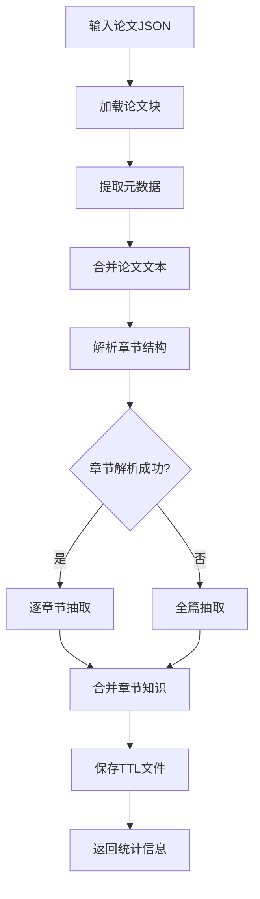

# SectionBasedExtractor 知识图谱抽取流程详解

## 概述

[`SectionBasedExtractor`](../agents/extractor/section_based_extraction.py:17) 是专门用于从学术论文中抽取知识图谱的核心组件，采用基于章节的分段式抽取策略，生成TTL格式的知识图谱。

## 🔄 核心抽取流程

### 1. 总体流程图



### 2. 主要方法调用链

#### 2.1 入口方法
```python
def process_single_paper(self, paper_file: str, evaluation_result: Dict = None) -> Dict:
    """主入口方法 - 工作流集成接口"""
    return self.process_paper(paper_file, evaluation_result)
```

#### 2.2 核心处理方法
```python
def process_paper(self, paper_file: str, evaluation_result: Dict = None) -> Dict:
    """处理单个论文的完整流程"""
    # 1. 加载论文数据
    chunks = self.load_paper_chunks(paper_file)

    # 2. 提取元数据
    metadata = self.extract_paper_metadata(chunks)

    # 3. 合并文本
    full_text = self.merge_paper_chunks(chunks)

    # 4. 执行章节抽取
    knowledge_graph = self.extract_section_knowledge(full_text, metadata, improvement_suggestions)

    # 5. 保存结果
    saved_file = self.save_extraction_results_with_evaluation(...)

    return {统计信息和结果}
```

## 📊 章节解析策略

### 1. 论文预处理

#### 1.1 加载论文块 ([load_paper_chunks](../agents/extractor/section_based_extraction.py:52))
```python
def load_paper_chunks(self, paper_file: str) -> List[Dict]:
    """加载论文JSON文件中的数据块"""
    with open(paper_file, 'r', encoding='utf-8') as f:
        data = json.load(f)
    return data if isinstance(data, list) else [data]
```

#### 1.2 合并为全文 ([merge_paper_chunks](../agents/extractor/section_based_extraction.py:62))
```python
def merge_paper_chunks(self, chunks: List[Dict]) -> str:
    """将论文块合并为带章节标记的全文"""
    full_text = ""
    for i, chunk in enumerate(chunks):
        section_id = chunk.get('id', f'chunk_{i}')
        full_text += f"\n=== SECTION: {section_id} (CHUNK {i}) ===\n"
        full_text += chunk['text'] + "\n"
    return full_text.strip()
```

#### 1.3 元数据提取 ([extract_paper_metadata](../agents/extractor/section_based_extraction.py:75))
```python
def extract_paper_metadata(self, chunks: List[Dict]) -> Dict[str, str]:
    """提取论文基本信息"""
    metadata = {
        'title': 'Unknown Title',
        'authors': 'Unknown Authors',
        'chunks': len(chunks),
        'timestamp': datetime.now().isoformat()
    }
    # 从第一块中尝试提取标题
    return metadata
```

### 2. 章节解析 ([parse_sections_from_text](../agents/extractor/section_based_extraction.py:229))

```python
def parse_sections_from_text(self, paper_text: str) -> List[Dict]:
    """从合并文本中解析章节"""
    sections = []
    lines = paper_text.split('\n')
    current_section = None
    current_content = []

    for line in lines:
        if line.startswith('=== SECTION:') and 'CHUNK' in line:
            # 保存前一个章节
            if current_section:
                sections.append({
                    'name': current_section['name'],
                    'chunk_id': current_section['chunk_id'],
                    'content': '\n'.join(current_content).strip()
                })

            # 解析新章节标题
            # 格式: === SECTION: SectionName (CHUNK X) ===
            parts = line.split('(CHUNK')
            if len(parts) == 2:
                section_name = parts[0].replace('=== SECTION:', '').strip()
                chunk_id = parts[1].split(')')[0].strip()
                current_section = {'name': section_name, 'chunk_id': chunk_id}
        else:
            if current_section:
                current_content.append(line)

    return sections
```

## 🧠 知识抽取核心逻辑

### 1. 章节级抽取策略 ([extract_section_knowledge](../agents/extractor/section_based_extraction.py:183))

```python
def extract_section_knowledge(self, paper_text: str, metadata: Dict, improvement_suggestions: str = "") -> str:
    """基于章节的分段抽取策略"""

    # 1. 解析章节
    sections = self.parse_sections_from_text(paper_text)

    if not sections:
        # 降级为全文抽取
        return self.extract_full_paper(paper_text, metadata, improvement_suggestions)

    # 2. 逐章节抽取
    all_knowledge_graphs = []

    for section_info in sections:
        section_name = section_info['name']
        chunk_id = section_info['chunk_id']
        content = section_info['content']

        # 抽取单个章节的知识
        section_kg = self.extract_single_section(content, section_name, chunk_id, metadata, improvement_suggestions)

        if section_kg and "API Error" not in section_kg:
            all_knowledge_graphs.append(f"# ===== SECTION: {section_name.upper()} =====\n{section_kg}")

        # 章节间暂停，避免API限制
        time.sleep(1)

    # 3. 合并所有章节知识
    combined_kg = "\n\n".join(all_knowledge_graphs)
    return combined_kg
```

### 2. 单章节抽取 ([extract_single_section](../agents/extractor/section_based_extraction.py:117))

这是知识抽取的核心方法，使用GPT模型进行结构化抽取：

```python
def extract_single_section(self, section_text: str, section_name: str, chunk_id: int,
                          metadata: Dict, improvement_suggestions: str = "") -> str:
    """从单个章节抽取知识图谱"""

    # 1. 构建系统提示
    system_prompt = f"""You are an expert knowledge extractor. Extract ALL entities, relationships, and facts from this academic paper section.

Section: {section_name} (Chunk {chunk_id})
Paper: {metadata['title']}

{self.section_prompt}

FOCUS FOR THIS SECTION:
- Extract EVERY entity mentioned (models, datasets, metrics, methods, authors, organizations)
- Extract EVERY relationship and comparison
- Extract ALL numerical values and scores
- Create comprehensive triples for multi-hop reasoning

TARGET: 20-50 triples from this section alone."""

    # 2. 构建用户提示
    user_prompt = f"""Extract MAXIMUM TRIPLES from this section of the academic paper.

SECTION: {section_name} (CHUNK {chunk_id})

SECTION CONTENT:
{section_text}

EXTRACTION REQUIREMENTS:
- Extract EVERY entity mentioned
- Extract EVERY relationship, comparison, evaluation
- Extract ALL numerical values with context
- Use :sourceChunk "{chunk_id}" and :sourceSection "{section_name}" for ALL triples

OUTPUT FORMAT:
```turtle
# Entities from {section_name}
:EntityName rdf:type :EntityType ;
    :sourceChunk "{chunk_id}" ;
    :sourceSection "{section_name}" ;
    :contextText "original text snippet" .

# Relationships from {section_name}
:Entity1 :relationshipType :Entity2 ;
    :sourceChunk "{chunk_id}" ;
    :sourceSection "{section_name}" ;
    :contextText "original text snippet" .
```"""

    # 3. 调用GPT API
    messages = [
        {"role": "system", "content": system_prompt},
        {"role": "user", "content": user_prompt}
    ]

    return self.call_openai_api(messages, max_tokens=3000)
```

### 3. 全文降级抽取 ([extract_full_paper](../agents/extractor/section_based_extraction.py:268))

当章节解析失败时的备用方案：

```python
def extract_full_paper(self, paper_text: str, metadata: Dict, improvement_suggestions: str = "") -> str:
    """全文抽取的降级策略"""

    system_prompt = f"""Extract knowledge from this academic paper for multi-hop reasoning.

Paper: {metadata['title']}
{self.section_prompt}"""

    user_prompt = f"""Extract ALL entities and relationships from this paper:

{paper_text[:40000]}  # 限制为40K字符

Target: 100+ triples covering all sections."""

    return self.call_openai_api(messages, max_tokens=4000)
```

## 📝 抽取提示模板

### 核心抽取提示 ([section_based_extraction_prompt.txt](../agents/extractor/section_based_extraction_prompt.txt:1))

提示模板定义了详细的抽取规则：

#### 1. 抽取策略
```text
## MAXIMIZED EXTRACTION STRATEGY:
### Extract EVERYTHING - No Detail Too Small
- Extract ALL mentioned models, datasets, metrics, methods, techniques, algorithms
- Extract ALL numerical values, percentages, scores, parameters, sizes
- Extract ALL relationships between ANY two entities
- Extract ALL comparisons, improvements, evaluations, applications
```

#### 2. 关系类型定义
```text
### Comprehensive Relation Types for Multi-Hop Reasoning:
:evaluatedOn → model tested on dataset
:achievesScore → performance value achieved
:outperforms → comparison between models
:improves → enhancement relationship
:basedOn → derivation/extension relationship
:uses → utilization relationship
# ... 更多关系类型
```

#### 3. 实体类型要求
```text
#### 1. Entity Types to Extract:
- Models: GPT-4, BERT, Llama-2, Transformer, etc.
- Datasets: WinoGrande, SQuAD, GLUE, etc.
- Metrics: Accuracy, F1, BLEU, ROUGE, Perplexity, etc.
- Methods: Fine-tuning, Training, Optimization, etc.
```

#### 4. TTL格式要求
```text
### Triple Format - MANDATORY for ALL extractions:
```turtle
:Entity1 :relation :Entity2 ;
    :sourceChunk "X" ;
    :sourceSection "SectionName" ;
    :contextText "Original snippet..." .
```
```

## 📊 统计信息收集

### 1. 统计指标 ([process_paper_from_text](../agents/extractor/section_based_extraction.py:485))

```python
statistics = {
    "total_triples": knowledge_graph.count(" ;") + knowledge_graph.count(" .") - knowledge_graph.count("# "),
    "models_extracted": knowledge_graph.count("rdf:type :Model"),
    "datasets_extracted": knowledge_graph.count("rdf:type :Dataset"),
    "metrics_extracted": knowledge_graph.count("rdf:type :Metric"),
    "methods_extracted": knowledge_graph.count("rdf:type :Method")
}
```

### 2. 统计说明

- **total_triples**: 总三元组数量（通过计算`;`和`.`符号数量）
- **models_extracted**: 模型实体数量（通过计算`rdf:type :Model`出现次数）
- **datasets_extracted**: 数据集实体数量
- **metrics_extracted**: 指标实体数量
- **methods_extracted**: 方法实体数量

## 💾 结果保存

### 1. TTL文件保存

#### 基础保存 ([save_extraction_results](../agents/extractor/section_based_extraction.py:300))
```python
turtle_file = self.output_dir / f"{base_name}_extraction.ttl"
with open(turtle_file, 'w', encoding='utf-8') as f:
    f.write(knowledge_graph)
```

#### 带评估信息的保存 ([save_extraction_results_with_evaluation](../agents/extractor/section_based_extraction.py:314))
```python
# 添加评估头部
evaluation_header = f"""# ===== EVALUATION RESULTS =====
# Evaluation Passed: {evaluation_passed}
# Can Proceed to QA Generation: {evaluation_passed}
# Timestamp: {timestamp}
# Improvement Suggestions: {improvement_suggestions}
# ===== KNOWLEDGE GRAPH =====
"""

# 保存TTL文件
with open(turtle_file, 'w', encoding='utf-8') as f:
    f.write(evaluation_header)
    f.write(knowledge_graph)

# 保存评估元数据
evaluation_file = self.output_dir / f"{base_name}_metadata.json"
evaluation_data = {
    "paper_name": paper_name,
    "evaluation_passed": evaluation_passed,
    "improvement_suggestions": improvement_suggestions,
    "timestamp": timestamp,
    "metadata": metadata
}
```

### 2. 输出文件结构

```
outputs/section_based_extractions/
├── paper_name_extraction.ttl          # 知识图谱TTL文件
├── paper_name_metadata.json           # 评估元数据
└── paper_name_evaluation.json         # TTL评估器结果（如果运行了评估）
```

## 🔄 改进机制

### 1. 评估反馈集成

当TTL评估器返回改进建议时，提取器会在下次抽取时应用：

```python
# 在 extract_single_section 中
if improvement_suggestions:
    improvement_guidance = f"""
IMPROVEMENT GUIDANCE (from evaluator):
{improvement_suggestions}

Please incorporate these suggestions in your extraction to improve the quality of the knowledge graph."""
```

### 2. 典型改进建议

- "需要更多实体关系"
- "缺少数值数据的具体上下文"
- "某些实体类型覆盖不足"
- "需要增加多跳推理路径"

## ⚙️ 配置参数

### 1. 模型配置 (config.yaml)
```yaml
extractor:
  model: "deepseek-v3.1"        # 抽取模型
  temperature: 0.1              # 低温度保证一致性
  max_tokens: 3000             # 单次响应最大长度
  output_dir: "outputs/section_based_extractions"
```

### 2. 抽取目标
- **每章节目标**: 20-50个三元组
- **全文目标**: 100+个三元组
- **质量要求**: 支持多跳推理

## 🎯 关键特性

### 1. 章节感知抽取
- 按论文章节结构进行抽取
- 保持章节上下文信息
- 支持章节特定的抽取重点

### 2. 溯源信息
- 每个三元组都包含来源信息
- `:sourceChunk`: 数据块标识
- `:sourceSection`: 章节名称
- `:contextText`: 原始文本片段

### 3. 多跳推理支持
- 专门设计用于多跳推理的抽取提示
- 强调实体间关系和路径
- 确保生成的知识图谱支持复杂查询

### 4. 容错机制
- 章节解析失败时降级为全文抽取
- API调用失败有错误处理
- 支持基于评估建议的重试

## 📈 性能和成本考虑

### 1. API调用策略
- 按章节分别调用，避免单次API调用过长
- 章节间添加延迟，避免速率限制
- 支持不同模型的令牌限制

### 2. 成本优化
- 通过temperature=0.1减少生成变化
- 明确的输出格式要求减少重试
- 章节级处理可并行化（需修改）

这个抽取器的设计体现了对学术论文结构的深入理解，通过章节感知、溯源信息支持和多跳推理优化，为后续的QA生成提供了高质量的知识图谱基础。