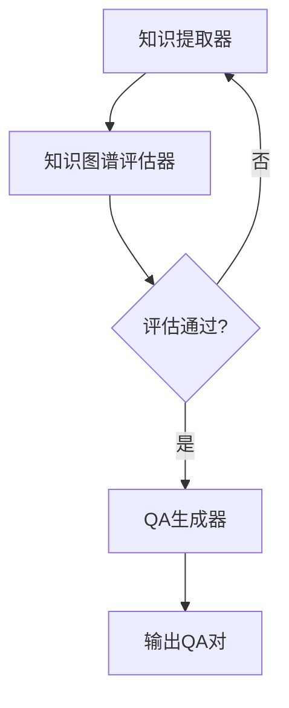

# QA生成器分析 - 评估功能调查

## 问题回答

**问：系统是否有对生成的QA对进行评估？**

**答：目前系统没有专门对生成的QA对进行质量评估。**

## 详细分析

### 1. QA生成器概述

**文件位置**: [`agents/QAgenerator/section_multi_hop_qa_generator.py`](../agents/QAgenerator/section_multi_hop_qa_generator.py:12)

**主要功能**:
- 从TTL格式知识图谱生成多跳推理QA对
- 支持基于章节的路径发现和问题生成
- 生成多选题格式（A、B、C、D选项）
- 提供详细的解释和推理路径

### 2. 当前工作流程



从工作流可以看出，**只有知识图谱经过了质量评估，生成的QA对没有后续的质量评估环节**。

### 3. QA生成器的输出文件

#### 3.1 详细版本 (`*_qa_detailed.json`)
```json
{
  "section": "章节名称",
  "hop_path": ["实体1", "关系1", "实体2", "关系2", "实体3"],
  "question": "生成的多跳问题",
  "options": {
    "A": "选项A",
    "B": "选项B",
    "C": "选项C",
    "D": "选项D"
  },
  "correct_answer": "B",
  "explanation": "详细解释",
  "source_triples": ["相关的三元组"]
}
```

#### 3.2 简化版本 (`*_qa_simplified.json`)
```json
{
  "section": "章节名称",
  "question": "生成的多跳问题",
  "options": {
    "A": "选项A",
    "B": "选项B",
    "C": "选项C",
    "D": "选项D"
  },
  "correct_answer": "B",
  "explanation": "详细解释"
}
```

#### 3.3 统计信息 (`*_qa_stats.txt`)
- 总体统计信息
- 按章节分布
- 答案分布
- 示例问题

### 4. 当前质量控制机制

#### 4.1 间接质量控制
虽然QA对本身没有直接评估，但通过以下机制间接保证质量：

1. **知识图谱质量门槛**
   - 只有通过评估的知识图谱才会被用于生成QA
   - TTL评估器的5个维度确保了输入质量

2. **路径质量过滤**
   ```python
   def find_3hop_paths(self, triples: List[Dict], max_paths_per_section: int = 10):
       # 过滤重复和无效路径
       # 限制路径长度和复杂度
   ```

3. **生成参数控制**
   - `max_paths_per_section`: 每章节最多路径数
   - `max_qa_per_section`: 每章节最多QA对数

#### 4.2 配置限制
```yaml
qa_generator:
  model: "deepseek-v3.1"
  temperature: 0.7           # 创意性控制
  max_tokens: 800           # 答案长度限制
  max_paths_per_section: 10  # 路径数量限制
  max_qa_per_section: 5      # QA数量限制
```

### 5. 缺失的QA评估功能

#### 5.1 应该评估的维度

1. **问题质量**
   - 语法正确性
   - 语义清晰度
   - 与知识图谱的一致性

2. **选项设计**
   - 干扰项的合理性
   - 唯一正确答案
   - 选项间的区分度

3. **推理复杂度**
   - 多跳路径的合理性
   - 推理逻辑的连贯性
   - 难度级别的适宜性

4. **解释质量**
   - 准确性
   - 完整性
   - 可理解性

### 6. 建议的QA评估器实现

#### 6.1 QA评估器架构设计

```python
class QAQualityEvaluator:
    """QA对质量评估器"""

    def __init__(self, config: Dict = None):
        self.config = config or {}
        self.client = OpenAI(api_key=os.getenv('OPENAI_API_KEY'))
        self.evaluation_prompt = self._load_evaluation_prompt()

    def evaluate_qa_pair(self, qa_pair: Dict) -> Dict:
        """评估单个QA对的质量"""

        # 构建评估提示
        prompt = self.evaluation_prompt.format(
            question=qa_pair['question'],
            options=qa_pair['options'],
            correct_answer=qa_pair['correct_answer'],
            explanation=qa_pair['explanation'],
            hop_path=qa_pair.get('hop_path', [])
        )

        # 调用GPT进行评估
        response = self.client.chat.completions.create(
            model=self.config.get('model', 'gpt-4o'),
            messages=[
                {"role": "system", "content": "你是专业的QA质量评估专家"},
                {"role": "user", "content": prompt}
            ],
            temperature=0.1
        )

        return self._parse_evaluation_result(response.choices[0].message.content)

    def evaluate_qa_batch(self, qa_pairs: List[Dict]) -> Dict:
        """批量评估QA对"""
        results = []
        for qa_pair in qa_pairs:
            result = self.evaluate_qa_pair(qa_pair)
            results.append(result)

        return self._aggregate_results(results)
```

#### 6.2 评估维度设计

```python
EVALUATION_DIMENSIONS = {
    "question_clarity": {
        "weight": 0.25,
        "description": "问题清晰度和无歧义性"
    },
    "option_quality": {
        "weight": 0.20,
        "description": "选项设计的合理性和干扰项有效性"
    },
    "correctness": {
        "weight": 0.25,
        "description": "答案正确性和与知识图谱一致性"
    },
    "reasoning_complexity": {
        "weight": 0.15,
        "description": "多跳推理的合理性和复杂度"
    },
    "explanation_quality": {
        "weight": 0.15,
        "description": "解释的准确性和完整性"
    }
}
```

#### 6.3 在工作流中的集成

```python
def generate_and_evaluate_qa(self, state: WorkflowState) -> WorkflowState:
    """生成QA对并进行质量评估"""

    # 1. 生成QA对
    qa_gen = self._get_qa_generator()
    qa_gen.run_pipeline(ttl_file_path=extraction_file, ...)

    # 2. 评估QA质量
    qa_evaluator = self._get_qa_evaluator()
    qa_file = state.get("qa_file")

    with open(qa_file, 'r', encoding='utf-8') as f:
        qa_pairs = json.load(f)

    evaluation_result = qa_evaluator.evaluate_qa_batch(qa_pairs)

    # 3. 质量过滤
    if evaluation_result['average_score'] >= self.config['qa_evaluator']['threshold']:
        state['qa_evaluation_passed'] = True
        state['qa_evaluation_file'] = self._save_qa_evaluation(evaluation_result, qa_file)
    else:
        state['qa_evaluation_passed'] = False
        state['qa_improvement_suggestions'] = evaluation_result['improvement_suggestions']

    return state
```

### 7. 快速实现方案

#### 7.1 简单的QA质量检查器

```python
def basic_qa_quality_check(qa_pairs: List[Dict]) -> Dict:
    """基础QA质量检查（不依赖GPT）"""

    issues = []
    quality_scores = []

    for i, qa in enumerate(qa_pairs):
        score = 10.0
        qa_issues = []

        # 检查1: 问题长度
        if len(qa['question']) < 20:
            score -= 2
            qa_issues.append(f"问题过短: {qa['question'][:30]}...")

        # 检查2: 选项数量
        if len(qa['options']) != 4:
            score -= 5
            qa_issues.append("选项数量不等于4")

        # 检查3: 正确答案有效性
        if qa['correct_answer'] not in qa['options']:
            score -= 10
            qa_issues.append("正确答案不在选项中")

        # 检查4: 解释存在性
        if not qa.get('explanation') or len(qa['explanation']) < 50:
            score -= 3
            qa_issues.append("解释过短或缺失")

        # 检查5: 多跳路径存在
        if not qa.get('hop_path') or len(qa['hop_path']) < 3:
            score -= 2
            qa_issues.append("缺少多跳路径信息")

        quality_scores.append(score)
        if qa_issues:
            issues.append({
                'qa_index': i,
                'score': score,
                'issues': qa_issues
            })

    return {
        'average_score': sum(quality_scores) / len(quality_scores),
        'quality_distribution': [min(10, max(0, score)) for score in quality_scores],
        'problematic_qas': [issue for issue in issues if issue['score'] < 6],
        'total_qas': len(qa_pairs),
        'passed_threshold': sum(quality_scores) / len(quality_scores) >= 7.0
    }
```

### 8. 总结

#### 当前状态
- ❌ **没有专门的QA质量评估器**
- ✅ **有间接质量控制**（通过知识图谱评估门槛）
- ✅ **有基础参数限制**（数量、长度等）
- ✅ **有详细的统计信息**（分布、格式等）

#### 建议改进
1. **短期**: 实现基于规则的快速QA质量检查
2. **中期**: 开发GPT驱动的QA质量评估器
3. **长期**: 集成到工作流中，支持QA质量门槛和重试机制

#### 优先级建议
1. **高优先级**: 实现基础的QA质量检查器，检测明显错误
2. **中优先级**: 开发全面的QA质量评估框架
3. **低优先级**: 实现QA生成和评估的闭环优化

**结论**: 目前系统确实缺少对生成QA对的质量评估，这是一个值得改进的方向。建议根据实际需求优先实现基础的QA质量检查机制。