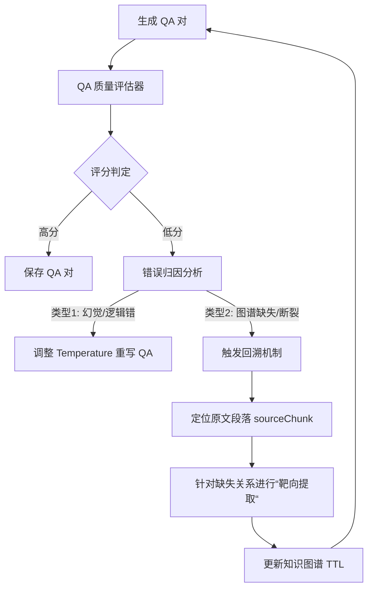

# 基于 Li 等（2024）“LLMs-as-Judges”范式的 QA 对质量评估方案

根据 Li 等（2024）提出的 “LLMs-as-Judges” 范式 [1]，对从知识图谱中生成的 QA 对进行评估，本质上属于**合成数据质量评估**，可视为 “模型增强” 或 “数据构造” 功能下的具体应用。该论文为此类评估提供了系统的方法论和最佳实践参考。

以下为结合论文内容设计的结构化评估方案：

------

## 1. 评估框架设计（方法论选择）

论文指出，构建 LLM 评估系统主要有三种配置：**单 LLM 系统**、**多 LLM 系统** 和 **人机协作系统** [1]。针对本场景，推荐采用 **“单 LLM 系统” 结合 “多 LLM 聚合” 的混合策略**，以平衡效率与可靠性。

- **核心评估者（单 LLM 系统）**
  选择一个性能强大的 LLM（如 GPT-4、Claude 3 等）作为主评判官。大量研究（如 LLM-EVAL [141]、G-EVAL [145]）已证明单 LLM 在各项评估任务中的有效性。
- **可靠性增强（多 LLM 聚合）**
  为减轻单一模型的偏见（如位置偏见、自我增强偏见等）并提高结果稳定性，可采用多模型独立评估后聚合的策略。例如：
  - 使用多个不同 LLM 分别评估同一 QA 对；
  - 通过投票或加权平均得出最终判断。
    此方法已被证明能显著提升评估可靠性 [8, 225]。

------

## 2. 评估维度与标准（定义输入）

根据 QA 对的结构，评估应覆盖以下关键维度，对应论文中强调的 **评估标准（C）** 与 **评估类型（T）** [1]：

### 2.1 问题与推理链质量

- **清晰度与合理性**：问题是否清晰、无歧义？是否基于提供的 `hop_path`（多跳路径）在逻辑上可推导？
- **复杂性**：问题是否真实反映多跳推理的挑战？`hop_path` 的长度和关系转换是否合理？

### 2.2 选项设计质量

- **区分度**：错误选项（干扰项）是否具有迷惑性，但又能被正确的推理链排除？
- **合理性**：所有选项在语法和常识上是否成立？避免出现明显荒谬的选项。

### 2.3 答案与解释质量

- **正确性**：`correct_answer` 是否与 `hop_path` 和 `source_triples` 严格一致？
- **解释充分性**：`explanation` 是否逐步清晰复现推理链？是否明确说明为何正确选项正确、其他选项错误？

### 2.4 事实一致性

- **溯源准确性**：`explanation` 和 `correct_answer` 是否都能从 `source_triples` 中得到完美支持？这是防止“幻觉”的关键。

------

## 3. 评估流程实施（如何执行）

建议采用以下三步流程，实现结构化、可操作的评估：

### 步骤一：点对点评分（Pointwise Evaluation）

- 要求 LLM 评判官针对上述每个维度进行评分（如 1–5 分）或分类（如“优秀 / 良好 / 合格 / 差”）。

### 步骤二：生成反馈

- 要求 LLM 为每个维度提供简短解释（E）和具体改进建议（F）。

  示例：  

  > “在解释部分，可以更明确地指出实体 A 与实体 C 是通过关系 R1 和 R2 间接关联的。”

### 步骤三：整体评估

- 综合各维度得分，给出整体质量判断（如“通过 / 需修订 / 拒绝”）。

------

## 4. 元评估与校准（确保评估者自身可靠）

为提升 LLM 评判官的可信度，需对其本身进行“元评估” [1]：

### 4.1 人工验证采样

- 随机抽取部分 QA 对，由领域专家人工评估；
- 将 LLM 评估结果与人工结果对比，计算一致性指标：
  - 斯皮尔曼秩相关系数（Spearman’s ρ）
  - 科恩卡帕系数（Cohen’s κ）

### 4.2 对抗偏见措施

论文指出 LLM 评判者可能存在多种偏见 [1]，建议采取以下对策：

- **位置偏差**：对选项顺序进行随机化；
- **冗长偏差**：在提示中明确要求“忽略答案长度，关注内容质量”；
- **自我增强偏差**：避免使用与生成模型相同的 LLM 作为评判者。

### 4.3 使用专用评判模型

可考虑采用在高质量评估数据上微调的开源评判模型，例如：

- **PROMETHEUS** [109]
- **JudgeLM** [301]
- **PandaLM** [236]
  这些模型专为评估任务设计，在特定维度上可能比通用 LLM 更稳定、偏见更少。

------

## 5. 总结与实施建议

为高效落地本评估方案，建议采取以下措施：

1. **构建评估管道**
   开发自动化脚本，将 QA 对以结构化提示发送至 LLM API（如 GPT-4），并解析返回的评分与反馈。
2. **设计详细提示**
   提示中应明确定义四个评估维度、评分标准，并提供 1–2 个正例/反例（In-Context Learning）以校准判断标准 [1]。
3. **实施多模型校验**
   对关键或困难的 QA 对，使用另一 LLM（如 Claude）进行二次评估，比较结果一致性。
4. **人工审核关键项**
   对 LLM 评估存在分歧或评分较低的样本，进行人工复审，确保最终数据集高质量。
5. **迭代优化闭环**
   根据初期评估结果，反哺并优化知识图谱 QA 生成模型，形成 **“生成 → 评估 → 改进”** 的闭环——这正是 “LLMs-as-Judges” 在模型增强中的核心价值体现 [1]。

> 通过以上方案，可系统化、自动化地评估生成 QA 对的质量，确保其作为下游任务（如问答模型训练或评测基准）的**可靠性**与**挑战性**。

---

# Gemini 的建议

### 方向一：构建“基于推理路径一致性”的医学 QA 评估框架（强推荐）

单纯用 LLM 打分（比如“这个回答好不好”）作为创新点略显单薄。但在医学领域，结合你现有的**多跳推理（Multi-hop Reasoning）**特性，可以做一个深度的创新。

创新点描述：

不仅评估“答案对不对”，更评估**“推理过程是否符合医学逻辑”以及“自然语言解释与知识图谱路径的一致性”**。

#### 1. 痛点与机会

- **现状**：你的 `qa_generator` 会输出 `hop_path`（三元组路径）、`explanation`（自然语言解释）和 `correct_answer`。
- **问题**：大模型常出现“答案对了，但推理过程是瞎编的”或者“推理路径是通的，但解释出现了幻觉”。
- **创新**：设计一个**双重一致性校验器（Dual-Consistency Validator）**。

#### 2. 具体实现方案

你可以设计一个 `MedicalQAEvaluator` 类（参考你设想的 `QAQualityEvaluator`），但增加以下独有维度：

- **维度 A：路径-解释对齐度 (Path-Explanation Alignment)**
  - **原理**：检查 `explanation` 中的逻辑链条是否严格对应 `hop_path` 中的实体和关系。
  - **实现**：提取 explanation 中的实体，计算其与 hop_path 中实体的重合率（IoU），检测是否引入了图谱中不存在的外部幻觉。
- **维度 B：医学安全性检测 (Clinical Safety Check)**
  - **原理**：医学问答不能有误导性。
  - **实现**：引入外部医学知识库（或利用 LLM 的医学知识），专门检测 QA 中的干扰项（Distractors）是否具有“危险的合理性”（例如：错误的药物组合看似合理但实则致命）。
- **维度 C：逻辑完备性 (Logical Completeness)**
  - **原理**：分析多跳推理是否断裂。
  - **实现**：如果 `hop_path` 是 A->B->C，评估器需要检查问题是否必须通过 B 才能推导出 C，防止跳跃式推理。

#### 3. 论文写法

- **题目拟定**：基于知识图谱路径一致性的医学问答数据自动生成与质量评估研究。
- **贡献点**：提出了一种结合符号化路径（KG Path）与语义解释（Explanation）的**混合评估指标**，解决了传统 BLEU/ROUGE 指标无法衡量逻辑正确性的问题。

------

### 方向二：改进 KG 构建——引入“医学本体约束”的提取机制

你提到 `knowledge_graph_construction_entrypoints.md` 中指出目前的提取器没有集成现有的本体。在医学领域，如果不使用标准本体（如 UMLS, SNOMED CT, MeSH），生成的实体会非常乱（例如 "Heart Attack" 和 "Myocardial Infarction" 被当成两个不同实体）。

创新点描述：

从“无约束提取”改进为**“本体引导的约束提取（Ontology-Guided Constrained Extraction）”**。

#### 1. 痛点与机会

- **现状**：`SectionBasedExtractor` 主要依赖 Prompt 从文本中提取三元组，容易产生非标准化术语。
- **创新**：在提取阶段注入医学本体作为“先验知识”。

#### 2. 具体实现方案

修改 `SectionBasedExtractor` 的工作流，参考文档中提到的集成方案：

- **步骤 1：本体加载**
  - 在初始化时加载医学核心词表（或通过 API 连接 UMLS）。
- **步骤 2：Prompt 增强**
  - 修改 `extract_single_section` 的 System Prompt。
  - 加入约束：“提取实体时，必须优先映射到以下本体类别...，如果实体有标准医学术语，请使用标准术语并在属性中记录原始文本。”
- **步骤 3：后处理对齐**
  - 在 `TTLEvaluator` 中增加一个 `Standardization` 维度，计算提取出的实体在标准医学库中的覆盖率。

------

### 综合建议：打造“生成-评估-修正”闭环（最佳硕士论文架构）

如果你想让论文更加扎实，我建议将上述两点结合，形成一个**数据飞轮**：

1. **构造（Construction）**：使用改进后的**本体引导提取器**构建初步医学 KG。
2. **生成（Generation）**：基于 KG 生成多跳 QA 对。
3. **评估（Evaluation - 核心创新）**：使用**路径一致性评估器**对 QA 对进行打分。
4. **闭环（Loop）**：**这是最亮眼的地方**——如果某条 QA 评分低，系统自动分析是“图谱错了”还是“生成模型幻觉了”。
   - 如果是图谱缺边导致推理断裂，**自动触发回溯机制**，重新去原文段落中提取缺失关系（Reference-based Refinement）。

### 针对你当前进度的执行路线

鉴于你已经实现了 LLM as Judge 和 QA 生成，**方案一（QA 评估）** 是性价比最高的，因为你不需要推翻现有的 KG 代码，只需要在管道末端加一个模块。

**下一步行动建议：**

1. **实现 QA 评估器**：参考 `qa_generator_analysis.md` 中的 `QAQualityEvaluator` 代码架构。
2. **设计医学 Prompt**：编写专门用于评估医学推理逻辑的 Prompt。
3. **数据对比实验**：
   - 实验组：经过你的评估器筛选/修正后的 QA 数据集。
   - 对照组：直接生成的原始 QA 数据集。
   - **验证指标**：用这两组数据分别微调一个小模型（如 Llama-3-8B），看谁在医学测试集上效果好。如果筛选后的数据训练出的模型效果更好，你的创新点就立住了。

你觉得这个基于“路径一致性”和“医学安全性”的评估方向符合你的预期吗？如果需要，我可以帮你细化评估器的 Prompt 设计。

---

# 关于闭环的理解

这是一个非常具有**技术深度**和**逻辑美感**的闭环设计。在学术论文中，这被称为**“Self-Refining RAG”**或**“Feedback-Driven Knowledge Graph Construction”**。

简单来说，就是把“QA 评估结果”当作一种“错误日志”，根据报错原因，指挥提取器回去“补课”。

由于你的系统已经保留了**溯源信息（Source Provenance）**（即 TTL 中的 `:sourceSection` 和 `:sourceChunk`），实现这个“回溯”机制非常可行。

以下是这个闭环的具体**执行流程**和**实现逻辑**：

------

### 核心流程图解



------

### 详细实施步骤

#### 第一步：诊断——QA 评估器不仅要打分，还要“归因”

你需要设计一个 Prompt，让 LLM 在评估时输出结构化的**错误原因（Error Diagnosis）**。

- **输入**：

  1. 生成的 QA 对（问题、答案、解释）。
  2. 用于生成的**子图路径（Hop Path）**。
  3. **原始文本片段**（通过 `:sourceChunk` 从文档中取回）。

- **Prompt 逻辑**：

  > "请检查这个问答对的逻辑。

  > 1. 答案是否能由子图路径完全推导出来？
  > 2. 如果不能，原始文本中是否包含相关信息？

  > 请输出错误类型：

  > - **Hallucination**: 子图和原文都不支持该答案，是模型瞎编的。
  > - **Missing_Relation**: 答案在原文中是正确的，但子图路径里缺了关键的一步（比如缺了 A -> B 的边）。"

#### 第二步：决策——区分“模型病”还是“数据病”

在代码逻辑中（例如 `workflow.py`），解析评估器的输出：

1. **Case A：模型幻觉 (Model Hallucination)**
   - **现象**：图谱里没有，原文里也没有，或者图谱有但模型没用。
   - **动作**：不需要回溯。降低 `temperature`，或者强化 Prompt 中的“必须基于给定三元组回答”的约束，重新生成 QA。
2. **Case B：图谱缺失 (Graph Deficiency) —— 这是你的创新核心**
   - **现象**：评估器发现：“原文中提到了阿司匹林会导致出血，生成的答案也这么说了，但是提供的图谱路径里**没有** `Aspirin --causes--> Bleeding` 这条边，导致推理链断裂。”
   - **动作**：触发**回溯机制（Backtracking）**。

#### 第三步：回溯——基于溯源信息的“靶向提取”

这是最关键的一步。利用你现有的 `SectionBasedExtractor`，但不是让它“重读全文”，而是“带着任务去读特定段落”。

1. 定位 (Locate)

从当前的 QA 上下文中获取实体 A（Aspirin）和实体 B（Bleeding）所在的 :sourceChunk ID（例如 chunk_5）。

2. 靶向提取 (Targeted Extraction)

调用 SectionBasedExtractor 的一个新模式（比如 refine_extraction）。

- 构造特殊的 Prompt：

  不要用通用的“提取所有实体”，而是用验证型 Prompt：

  > "我发现在 Chunk 5 中，可能存在 'Aspirin' 和 'Bleeding' 之间的关系，但在之前的提取中漏掉了。
  >
  > 请重读 Chunk 5，专门寻找这两个实体之间的关系。
  >
  > 如果存在，请以 TTL 格式输出这条特定的边；如果不存在，返回 None。"

**3. 代码实现思路（伪代码）**

你可以扩展 `SectionBasedExtractor` 类：

```Python
# 在 agents/extractor/section_based_extraction.py 中新增方法

def refine_extraction(self, chunk_text, entity1, entity2, missing_relation_hint):
    """
    回溯机制的核心：靶向提取
    """
    system_prompt = f"""
    You are a Knowledge Graph Repair Agent.
    Previous extraction missed a potential relation between '{entity1}' and '{entity2}'.
    Hint: {missing_relation_hint}
    
    Task: Read the text strictly. If the relation exists, output the missing Triple.
    """
    
    user_prompt = f"""
    TEXT: {chunk_text}
    
    Does a relation exist between {entity1} and {entity2}? 
    Output TTL format only.
    """
    
    # 调用 LLM ...
    return new_triples
```

#### 第四步：更新与闭环

1. **更新图谱**：将新提取到的三元组（例如 `:Aspirin :causes :Bleeding`）追加到 TTL 文件中。
2. **重新生成**：拿着更新后的图谱，重新运行 `QAGenerator`。
3. **结果**：这次生成的 QA 对，不仅答案正确，而且背后的 `hop_path` 是完整的、有证据支持的。

------

### 为什么这在“医学”领域特别重要？（答辩话术）

1. **安全性（Safety）**：医学不能容忍“对的答案，错的逻辑”。如果模型蒙对了“阿司匹林不能和华法林混用”，但图谱里没有这两个药的相互作用关系，那么这个问答对就是**不可解释**的，在临床上是危险的。
2. **长尾知识召回（Recall of Long-tail Knowledge）**：初次提取（通用提取）往往会漏掉很多细节（False Negatives）。通过 QA 生成过程中的逻辑断裂来**反向发现**这些遗漏，是一种非常高效的“查漏补缺”手段。

### 总结

这个闭环流程的实质是：

用“推理的连贯性”作为探针，去探测“知识提取的完备性”。

它把 QA 生成从一个单纯的“下游任务”变成了“图谱质量优化器”。这完全可以作为你硕士论文中最核心的创新点，因为它打通了**抽取（Extractor）**、**评估（Evaluator）**和**生成（Generator）**三个孤岛。