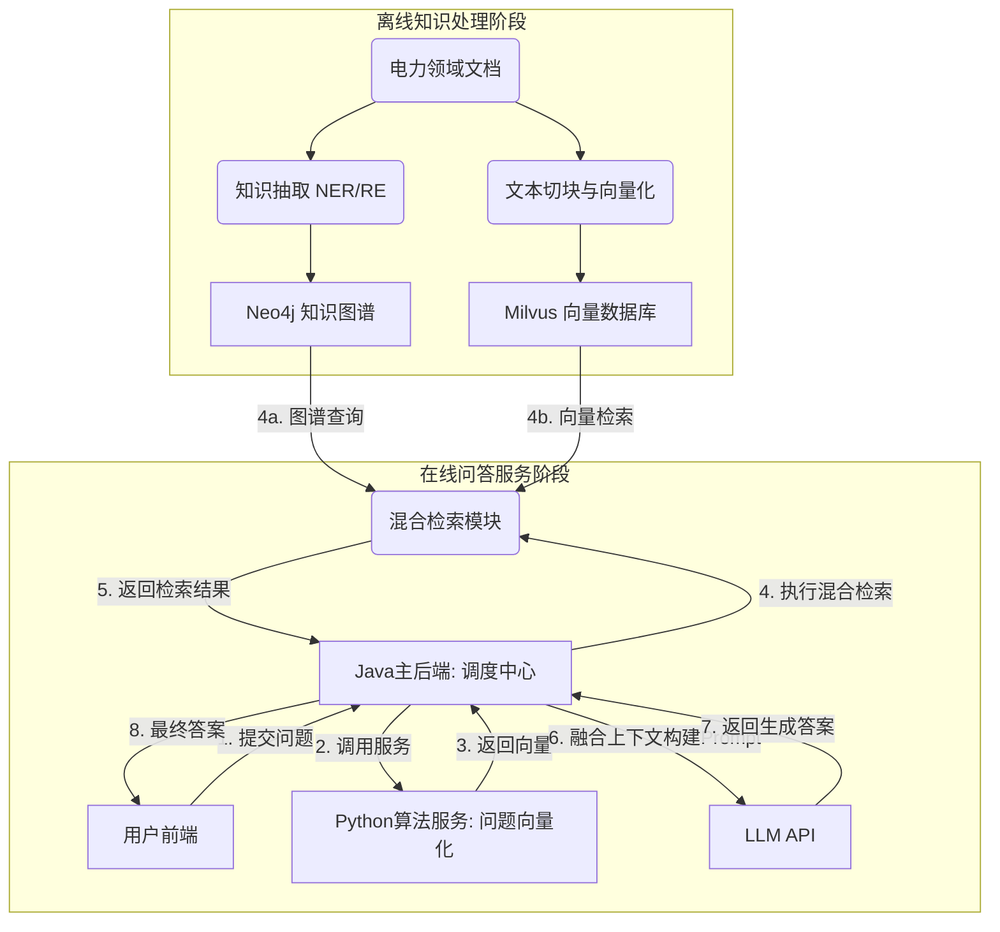

```mermaid
graph TD
    subgraph 离线知识处理阶段 
        A(电力领域文档) --> B(知识抽取 NER/RE);
        A --> C(文本切块与向量化);
        B --> D[Neo4j 知识图谱];
        C --> E[Milvus 向量数据库];
    end

    subgraph 在线问答服务阶段
        F[用户前端] -- 1. 提交问题 --> G[Java主后端: 调度中心];
        G -- 2. 调用服务 --> H[Python算法服务: 问题向量化];
        H -- 3. 返回向量 --> G;
        G -- 4. 执行混合检索 --> I(混合检索模块);
        D -- 4a. 图谱查询 --> I;
        E -- 4b. 向量检索 --> I;
        I -- 5. 返回检索结果 --> G;
        G -- 6. 融合上下文构建Prompt --> J[LLM API];
        J -- 7. 返回生成答案 --> G;
        G -- 8. 最终答案 --> F;
    end
```

