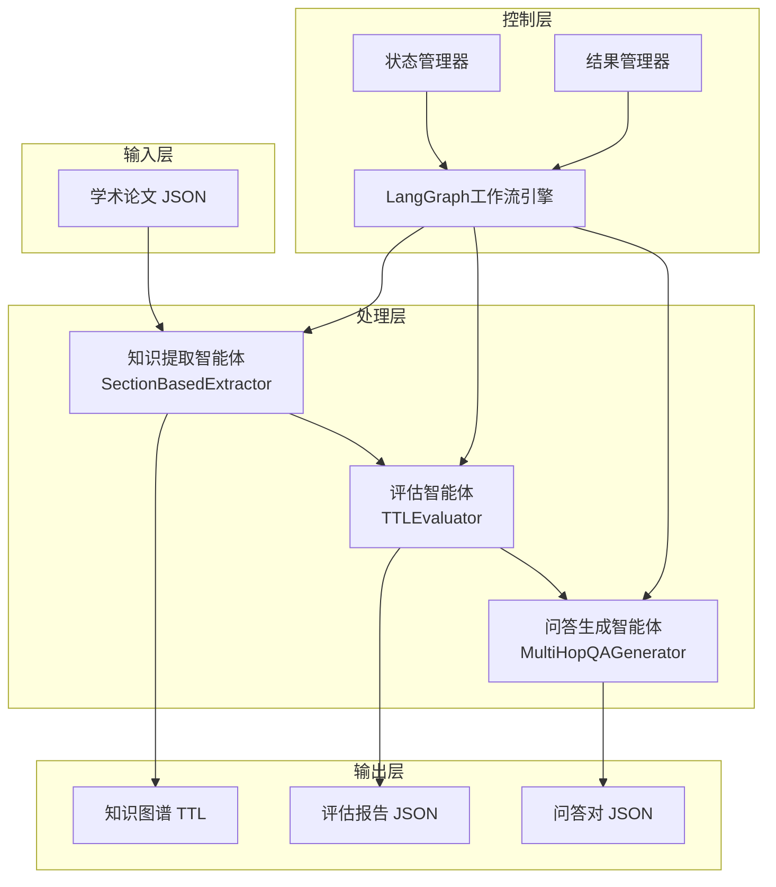
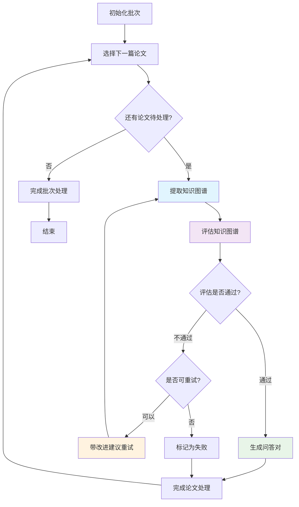

# 多智能体知识图谱处理流水线项目报告

## 摘要

本项目开发了一个基于LangGraph框架的多智能体知识图谱处理流水线，实现了从学术论文中自动提取、评估和生成问答对的完整工作流程。该系统采用三个专业智能体协同工作：知识图谱提取智能体、评估智能体和问答生成智能体，并通过状态管理和重试机制保证处理质量。

**关键词**: 知识图谱提取、多智能体系统、LangGraph、自动化评估、问答生成

## 1. 引言

### 1.1 研究背景
随着学术文献的快速增长，从科研论文中自动提取结构化知识成为重要需求。传统的手工知识抽取方法效率低下且难以扩展，而现有的自动化方法往往缺乏质量控制和后续处理能力。

### 1.2 研究目标
本项目旨在构建一个端到端的知识图谱处理流水线，具备以下能力：
- **自动化提取**: 从学术论文中提取高质量知识图谱
- **质量评估**: 多维度评估知识图谱质量并提供改进建议  
- **问答生成**: 基于高质量知识图谱生成多跳推理问答对
- **批量处理**: 支持大规模文档的批量自动化处理

## 2. 系统架构

### 2.1 整体设计
系统采用多智能体架构，包含三个核心智能体：



### 2.2 核心组件

#### 2.2.1 知识提取智能体 (SectionBasedExtractor)
- **功能**: 按章节提取知识图谱，输出TTL格式
- **技术**: 基于可配置LLM模型的section-wise处理
- **配置支持**: 模型选择、温度、token限制等参数可配置
- **输出**: RDF/TTL格式的知识图谱文件

#### 2.2.2 评估智能体 (TTLEvaluator)
- **功能**: 多维度评估知识图谱质量
- **评估指标**: 完整性、准确性、一致性、实用性等
- **配置支持**: 评估模型、阈值、评估参数可配置
- **输出**: 详细评估报告和改进建议

#### 2.2.3 问答生成智能体 (MultiHopQAGenerator)
- **功能**: 生成基于知识图谱的多跳推理问答
- **技术**: 可配置LLM驱动的智能问答对生成
- **配置支持**: 生成模型、创造性参数、输出控制可配置
- **输出**: 结构化的多选题问答对

### 2.3 配置管理架构

系统采用统一的配置管理架构，支持灵活的参数调整和环境适配：

```mermaid
graph TB
    subgraph "配置层"
        A[config.yaml<br/>主配置文件]
        B[.env<br/>环境变量]
        C[.env.template<br/>配置模板]
    end

    subgraph "加载层"
        D[load_config()<br/>配置加载器]
        E[validate_environment()<br/>环境验证]
    end

    subgraph "应用层"
        F[SectionBasedExtractor<br/>提取器配置]
        G[TTLEvaluator<br/>评估器配置]
        H[MultiHopQAGenerator<br/>生成器配置]
        I[Workflow<br/>工作流配置]
    end

    A --> D
    B --> D
    C --> B
    D --> F
    D --> G
    D --> H
    D --> I
    E --> D

    style A fill:#e1f5fe
    style B fill:#f3e5f5
    style D fill:#e8f5e8
```

**配置管理特性**：
- **环境变量替换**: 支持`${VAR_NAME:-default}`语法动态替换
- **模块化配置**: 每个智能体独立配置段
- **参数验证**: 自动验证必需配置项
- **默认值支持**: 提供合理的默认配置
- **API配置优先级**: 配置文件 > 环境变量 > 默认值
- **统一初始化**: 所有代理类通过config参数初始化

## 3. 工作流程

### 3.1 主要处理步骤

系统的核心工作流程如下图所示：



### 3.2 详细流程说明

#### 阶段1: 初始化 (initialize_batch)
```python
def initialize_batch(self, state: WorkflowState) -> WorkflowState:
    """
    - 创建批次ID和时间戳
    - 扫描输入目录获取待处理论文列表
    - 初始化状态管理器和结果管理器
    - 设置日志记录
    """
```

#### 阶段2: 论文选择 (select_next_paper)
```python  
def select_next_paper(self, state: WorkflowState) -> WorkflowState:
    """
    - 从论文队列中选择下一篇待处理论文
    - 检查是否存在中间结果可复用
    - 更新当前处理状态
    """
```

#### 阶段3: 知识提取 (extract_knowledge)
```python
def extract_knowledge(self, state: WorkflowState) -> WorkflowState:
    """
    - 调用SectionBasedExtractor按章节提取知识
    - 生成TTL格式的知识图谱文件
    - 记录提取过程的详细日志
    """
```

#### 阶段4: 质量评估 (evaluate_knowledge)
```python
def evaluate_knowledge(self, state: WorkflowState) -> WorkflowState:
    """
    - 使用TTLEvaluator对提取的知识图谱进行多维度评估
    - 计算综合质量分数
    - 生成改进建议用于可能的重试
    """
```

#### 阶段5: 重试决策 (decide_retry)
```python
def decide_retry(self, state: WorkflowState) -> WorkflowState:
    """
    - 检查重试次数是否达到上限
    - 整合评估建议作为重试时的改进提示
    - 决定是否进行重试或放弃处理
    """
```

#### 阶段6: 问答生成 (generate_qa)
```python
def generate_qa(self, state: WorkflowState) -> WorkflowState:
    """
    - 仅对通过评估的高质量知识图谱执行
    - 调用MultiHopQAGenerator生成多跳推理问答
    - 保存结构化的问答对数据
    """
```

### 3.3 条件路由机制

系统实现了智能的条件路由，根据处理状态动态决定下一步操作：

- **论文选择后路由**: 检查是否还有论文待处理
- **评估后路由**: 根据质量分数决定重试、生成问答或完成处理  
- **重试决策路由**: 根据重试次数和配置决定继续重试或放弃

## 4. 代码运行逻辑

### 4.1 环境准备

#### 4.1.1 环境变量配置
系统支持两种配置方式：

**方式1：使用配置文件（推荐）**
```yaml
# config.yaml
api:
  openai_api_key: "your-openai-api-key"
  openai_base_url: "https://api.openai.com/v1"
```

**方式2：使用环境变量**
```bash
# OpenAI API配置 (必需)
export OPENAI_API_KEY="your-openai-api-key"

# OpenAI API基础URL (可选，默认为官方API)
export OPENAI_BASE_URL="https://api.openai.com/v1"
```

**配置优先级**：配置文件 > 环境变量 > 默认值

#### 4.1.2 目录结构验证
确保项目目录结构如下：
```
getKG-schema/kg_pipeline/
├── agents/                    # 智能体组件
│   ├── extractor/            # 知识提取智能体
│   ├── evaluator/            # 评估智能体
│   └── QAgenerator/          # 问答生成智能体
├── utils/                    # 工具模块
├── data/                     # 输入数据目录
├── outputs/                  # 输出结果目录
├── config.yaml              # 配置文件
├── run_pipeline.py          # 主运行脚本
└── workflow.py              # 工作流定义
```

### 4.2 运行步骤

#### 步骤1: 环境验证
```bash
cd getKG-schema/kg_pipeline
python run_pipeline.py --validate-env
```
输出示例：
```
🔍 Validating environment variables...
✅ OPENAI_API_KEY (required): Present
✅ OPENAI_BASE_URL (optional): Present
✅ All required environment variables are present
```

#### 步骤2: 准备输入数据
将学术论文JSON文件放置在配置的输入目录中（默认为`data/data_test/`）：
```bash
ls data/data_test/
paper1.json  paper2.json  paper3.json
```

#### 步骤3: 运行流水线
```bash
# 全新运行
python run_pipeline.py

# 从检查点恢复运行
python run_pipeline.py --resume

# 使用自定义配置文件
python run_pipeline.py --config cconfig.yaml
```

#### 步骤4: 监控运行过程
系统提供详细的运行日志：
```
🚀 Starting Multi-Agent Knowledge Graph Pipeline...
📁 Configuration: config.yaml
🚀 Initializing batch processing...
📄 Processing paper: paper1.json
🔧 Extracting knowledge...
📊 Evaluating knowledge... Score: 8.5/10
✅ Evaluation passed! Generating QA...
✅ Paper completed successfully
📄 Processing paper: paper2.json
...
```

### 4.3 配置架构

#### 4.3.1 配置文件结构
系统采用YAML格式的配置文件(`config.yaml`)，支持环境变量替换和模块化配置管理：

```yaml
# Multi-Agent Knowledge Graph Pipeline Configuration

# API Configuration
api:
  openai_api_key: "sk-xxx"              # OpenAI API密钥
  openai_base_url: "https://api.openai.com/v1"  # API基础URL

# Input/Output Paths
paths:
  input_dir: "data/data"                # 输入目录
  output_dir: "outputs"                 # 输出目录
  extraction_dir: "section_based_extractions"
  evaluation_dir: "evaluations"
  qa_dir: "multi_hop_qa"

# Processing Parameters
processing:
  batch_size: 1                         # 批次大小(建议保持为1)
  max_retry_attempts: 2                 # 最大重试次数
  enable_retry_with_suggestions: true   # 启用改进建议重试

# Extractor Configuration
extractor:
  model: "deepseek-v3.1"               # 提取器模型
  max_tokens: 3000                     # 最大生成token数
  temperature: 0.1                     # 生成温度
  max_paths_per_section: 10            # 每节最大路径数
  max_qa_per_section: 5                # 每节最大QA数

# Evaluator Configuration
evaluator:
  model: "deepseek-v3.1"               # 评估器模型
  temperature: 0.1                     # 评估温度
  max_tokens: 2000                     # 最大token数
  threshold: 9                         # 通过评估的最低分数

# QA Generator Configuration
qa_generator:
  model: "deepseek-v3.1"               # QA生成器模型
  temperature: 0.7                     # 生成温度
  max_tokens: 800                      # 最大token数
  max_paths_per_section: 10            # 每节最大路径数
  max_qa_per_section: 5                # 每节最大QA数

# Workflow Configuration
workflow:
  enable_parallel_processing: false     # 并行处理开关
  save_intermediate_results: true      # 保存中间结果
  generate_statistics: true            # 生成统计信息
  verbose_logging: true                # 详细日志记录

# File Patterns
file_patterns:
  input_papers: "*.json"               # 输入文件模式
  extraction_output: "{paper_name}_extraction.ttl"
  evaluation_output: "{paper_name}_metadata.json"
  qa_output_detailed: "{paper_name}_qa_detailed.json"
  qa_output_simplified: "{paper_name}_qa_simplified.json"
  qa_output_stats: "{paper_name}_qa_stats.txt"

# Retry Configuration
retry:
  max_attempts: 3                      # 最大重试次数
  backoff_factor: 1.5                  # 退避因子
  enable_improvement_suggestions: true  # 启用改进建议

# Large Scale Processing Configuration
large_scale:
  batch_size: 50                       # 大规模处理批次大小
  max_concurrent: 4                    # 最大并发数
  checkpoint_interval: 10              # 检查点间隔
  enable_parallel: true                # 启用并行处理
  memory_management:
    max_memory_per_batch: "2GB"        # 每批次最大内存
    gc_interval: 5                     # 垃圾回收间隔
  monitoring:
    enable_progress_bar: true          # 启用进度条
    log_level: "INFO"                  # 日志级别
    save_intermediate_reports: true    # 保存中间报告
```

#### 4.3.2 环境变量配置
系统支持通过`.env`文件管理环境变量：

```bash
# .env 文件示例
# API 配置 (必需)
OPENAI_API_KEY=sk-your-api-key-here
OPENAI_BASE_URL=https://api.openai.com/v1

# 可选配置
LOG_LEVEL=INFO
VERBOSE_LOGGING=true
DEBUG_MODE=false
```

#### 4.3.3 配置加载机制
系统实现了统一的配置加载和管理机制：

```python
# utils/helpers.py
def load_config(config_path: str = "config.yaml") -> Dict[str, Any]:
    """
    加载配置文件，支持环境变量替换
    - 自动读取YAML配置文件
    - 支持环境变量替换 (${VAR_NAME})
    - 验证必需配置项
    """
```

#### 4.3.4 模型配置统一管理
所有智能体现在都支持从配置文件动态加载模型参数：

```python
# 配置传递流程
MultiAgentKGPipeline(config_path)
  → load_config(config_path)
  → SectionBasedExtractor(config=config)
  → TTLEvaluator(config=config)
  → MultiHopQAGenerator(config=config)
```

**关键配置项说明**：
- **模型选择**: 所有智能体支持可配置的LLM模型
- **参数调优**: temperature、max_tokens等参数可独立配置
- **阈值控制**: 评估通过阈值影响QA生成触发条件
- **重试策略**: 可配置重试次数和改进建议机制
- **文件路径**: 灵活的输入输出路径配置

## 5. 文件保存地址

### 5.1 输出目录结构

系统采用结构化的输出目录管理，所有结果保存在`outputs/`目录下：

```
outputs/
├── results/                           # 批次处理结果
│   └── batch_YYYYMMDD_HHMMSS/        # 按时间戳组织的批次目录
│       ├── batch_summary.json        # 批次处理摘要
│       ├── paper1_results.json       # 单篇论文处理结果
│       └── paper2_results.json
├── section_based_extractions/         # 知识图谱提取结果  
│   ├── paper1_section_extraction_20240101_120000.ttl
│   └── paper2_section_extraction_20240101_130000.ttl
├── evaluations/                       # 评估报告
│   ├── paper1_evaluation_20240101_120500.json  
│   └── paper2_evaluation_20240101_130500.json
├── multi_hop_qa/                      # 问答生成结果
│   ├── multi_hop_qa_paper1_20240101_121000.json
│   └── multi_hop_qa_paper2_20240101_131000.json
├── logs/                              # 运行日志
│   └── pipeline_20240101_120000.log
└── state/                             # 状态检查点
    └── checkpoints/
        └── batch_YYYYMMDD_HHMMSS/
```

### 5.2 文件命名规范

#### 5.2.1 提取结果文件
```
格式: {paper_name}_section_extraction_{timestamp}.ttl
示例: research_paper_section_extraction_20240101_120000.ttl
```

#### 5.2.2 评估结果文件  
```
格式: {paper_name}_evaluation_{timestamp}.json
示例: research_paper_evaluation_20240101_120500.json
```

#### 5.2.3 问答文件
```
格式: multi_hop_qa_{paper_name}_{timestamp}.json
示例: multi_hop_qa_research_paper_20240101_121000.json
```

### 5.3 文件内容格式

#### 5.3.1 知识图谱文件 (.ttl)
```turtle
@prefix : <http://example.org/kg#> .
@prefix rdf: <http://www.w3.org/1999/02/22-rdf-syntax-ns#> .
@prefix rdfs: <http://www.w3.org/2000/01/rdf-schema#> .

:entity1 rdf:type :Concept ;
         rdfs:label "Machine Learning" ;
         :hasProperty "supervised learning" .

:entity2 rdf:type :Method ;
         rdfs:label "Neural Network" ;
         :relatedTo :entity1 .
```

#### 5.3.2 评估结果文件 (.json)
```json
{
    "meta": {
        "paper_name": "research_paper",
        "timestamp": "2024-01-01T12:05:00",
        "model_used": "gpt-4o"
    },
    "scores": {
        "completeness": {"score": 8.5, "max_score": 10},
        "accuracy": {"score": 9.0, "max_score": 10},
        "consistency": {"score": 7.5, "max_score": 10}
    },
    "final_score": 8.3,
    "passed_threshold": true,
    "summary_advice": "Overall good quality with minor improvements needed...",
    "top_fixes": [
        "Add more specific entity relationships",
        "Improve property definitions"
    ]
}
```

#### 5.3.3 问答对文件 (.json)
```json
{
    "meta": {
        "paper_name": "research_paper",
        "timestamp": "2024-01-01T12:10:00",
        "total_questions": 15
    },
    "qa_pairs": [
        {
            "question": "What machine learning method is used for...",
            "options": ["A) Neural Networks", "B) SVM", "C) Decision Trees", "D) Random Forest"],
            "correct_answer": "A",
            "explanation": "According to the knowledge graph...",
            "difficulty": "medium",
            "reasoning_type": "multi-hop"
        }
    ]
}
```

## 6. 当前环境需求文档

### 6.1 依赖包列表

基于代码分析，以下是系统所需的完整依赖包：

```text
# requirements.txt

# 核心框架
openai>=1.0.0
langgraph>=0.1.0
pyyaml>=6.0

# 数据处理
pathlib2>=2.3.0
typing-extensions>=4.0.0

# 状态管理和序列化  
msgpack>=1.0.0

# 日志和工具
tqdm>=4.60.0

# 时间处理
python-dateutil>=2.8.0

# 文件系统操作
# pathlib, os, sys, json, re, logging 是Python标准库，无需安装

# 类型提示支持 (Python < 3.9)
typing-extensions>=4.0.0; python_version<"3.9"
```

### 6.2 Python版本要求
```
Python >= 3.8
推荐使用 Python 3.9+ 以获得更好的类型提示支持
```

### 6.3 系统要求
```
操作系统: Linux, macOS, Windows
内存: 建议4GB以上
存储: 至少1GB可用空间用于存储结果文件
网络: 稳定的互联网连接访问OpenAI API
```

### 6.4 安装命令
```bash
# 创建虚拟环境 (推荐)
python -m venv kg_pipeline_env
source kg_pipeline_env/bin/activate  # Linux/macOS
# 或
kg_pipeline_env\Scripts\activate     # Windows

# 安装依赖
pip install -r requirements.txt

# 验证安装
python -c "import openai, langgraph, yaml; print('All packages installed successfully')"
```

## 7. 性能特性

### 7.1 处理能力
- **批量处理**: 支持大规模文档的自动化批量处理
- **并发控制**: 可配置的批次大小和并发参数
- **内存优化**: 逐个处理论文，避免内存溢出

### 7.2 可靠性保证
- **检查点机制**: 支持中断恢复，避免重复处理
- **重试机制**: 智能重试带改进建议，提高成功率
- **错误处理**: 完整的异常捕获和错误报告

### 7.3 扩展性设计
- **模块化架构**: 各智能体独立，易于替换和升级
- **配置驱动**: 关键参数可通过配置文件调整
- **状态分离**: 状态管理与业务逻辑分离，支持分布式扩展

## 8. 配置系统升级（2025年12月更新）

### 8.1 升级内容
项目完成了配置系统的全面整合升级，实现了统一的配置管理：

1. **API配置统一化**
   - 所有代理（SectionBasedExtractor、TTLEvaluator、MultiHopQAGenerator）现在支持从配置文件读取API配置
   - 配置优先级：配置文件 > 环境变量 > 默认值

2. **模型参数完全可配置**
   - 每个智能体的模型选择、温度、最大token数等参数完全可配置
   - 支持不同代理使用不同的模型和参数

3. **代码修改总结**
   - 修改了所有代理类的构造函数，添加 `config` 参数
   - 更新了工作流类，确保配置正确传递
   - 保持了向后兼容性

### 8.2 新增文件
- **`config.yaml`**: 更新为包含所有实际使用的配置项
- **`.env.template`**: 环境变量模板文件
- **`config_complete.yaml`**: 完整配置文件（备份）

### 8.3 使用示例
```yaml
# config.yaml
api:
  openai_api_key: ${OPENAI_API_KEY}
  openai_base_url: ${OPENAI_BASE_URL:-https://api.openai.com/v1}

extractor:
  model: "gpt-4o-mini"
  temperature: 0.1
  max_tokens: 3000

evaluator:
  model: "gpt-4o-mini"
  temperature: 0.1
  max_tokens: 2000
  threshold: 6

qa_generator:
  model: "gpt-4o-mini"
  temperature: 0.7
  max_tokens: 800
```

## 9. 结论

本项目成功实现了一个完整的多智能体知识图谱处理流水线，具备以下主要贡献：

1. **端到端自动化**: 从论文输入到问答生成的全流程自动化
2. **质量保证机制**: 多维度评估和重试机制确保输出质量
3. **工程化设计**: 完整的日志、状态管理和错误处理
4. **可扩展架构**: 模块化设计支持功能扩展和性能优化
5. **统一配置管理**: 灵活的配置系统，支持多种配置方式

该系统为学术知识的自动化提取和处理提供了有效解决方案，具有良好的实用价值和推广前景。

---

**生成时间**: 2025年12月10日
**更新时间**: 2025年12月10日（配置系统升级）
**版本**: v1.1
**项目路径**: `/Users/joer/Gitroom/qg_pipeline/`